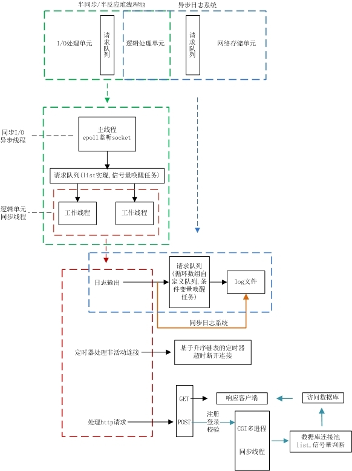

# Web Server
实现一个Linux下C++的web服务器

## 一、目标
访问服务器数据库实现web端用户注册、登录功能，可以请求服务器图片和视频文件

## 二、 技术点
+ I/O多路复用模型：非阻塞socket + epoll(ET和LT均实现)
+ 事件处理模式：提供Reactor模式和模拟Proactor模式两种选项
+ 并发编程：多线程+线程池
+ HTTP请求报文：使用（主从）状态机解析，支持解析Get和Post两种报文
+ 数据库：访问MySQL服务器数据库实现web端用户注册、登录功能
+ 定时器：处理非活动连接，实现基于升序链表定时器
+ 日志系统：实现同步/异步日志系统，记录服务器运行状态
+ 压力测试：经Webbench压力测试可以实现上万的并发连接数据交换

## 三、框架

## 四、开发
1. 安装mysql  
[在Ubuntu 20.04上安装MySQL教程](https://www.cnblogs.com/2020javamianshibaodian/p/12920243.html)
2. 安装mysql开发包
sudo apt-get install libmysqlclient-dev
